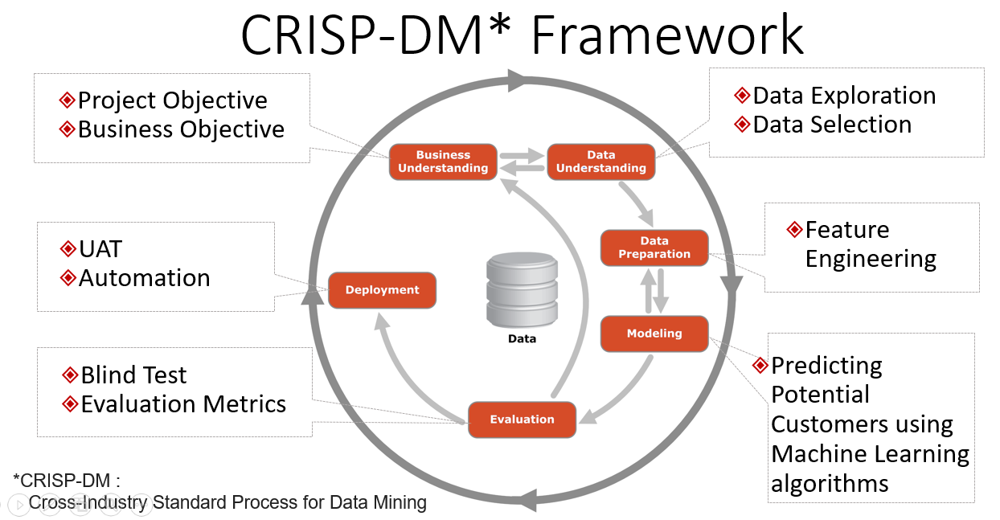
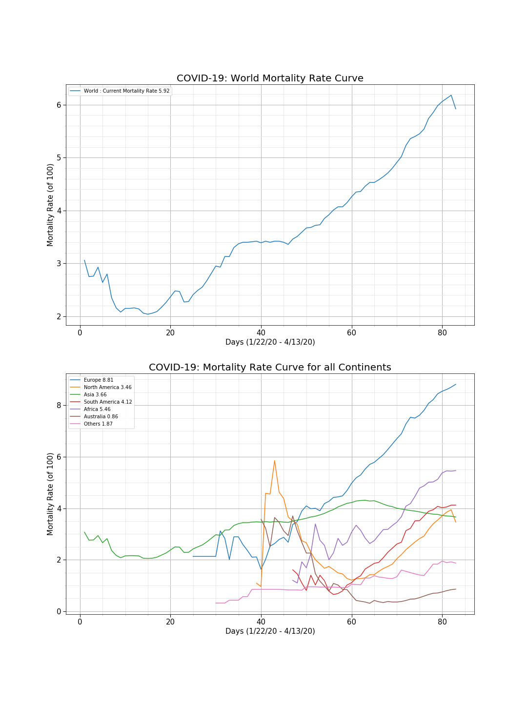

# Data_Science_Blog

## Introduction
Given the large number of industries and problems that fall under the umbrella of Data Science, there are a lot of different tools and individual nuances of a particular company or industry for finding solutions. However, there's actually a common process used to find many solutions in Data Science. This process is known as the Cross Industry Standard Process for Data Mining or CRISP-DM. This process has been an industry standard for analyzing data for years and it has six major phases provided in an image below :- 

### 1. Business Understanding

Given the current scenario of Covid-19, we want to analyze the trends, correlations and expectations of impact of Covid-19 in today's world with the help of visualizations :- 
1. Top 15 countries that has most number of confirmed, active,recovered & death cases reported from the Covid-19?
2. Trend Comparision between different countries and analyze which country has doubling of cases in Corona Virus every day, every second day, every 4 days, every week, every month? 
3. Covid-19 Mortality rate with respect to all the continents.

### 2. Data Understanding
Here we used Covid-19 data from 22 January 2019 to 11th April 2020 to attempt to answer our questions of interest.We answered our questions using visualizations techniques and making the impact clear.

### 3. Data Preparation
This is commonly denoted as 80% of the process. From working with missing data to finding a way to work with categorical variables. Firstly, we replaced the country names to enhance readability. Secondly, we added continents for each country which would help us in the analysis of mortality rate with respect to each continent.Thirdly, we replaced the NAN values with empty spaces. There was ton more we could have done to wrangle the data, but you have to start somewhere, and then you can always iterate.

### 4. Modeling
We were finally able to model the data, but we had some back and forth with step 3. before we were able to build a model that had okay performance. There still may be changes that could be done to improve the model we have in place. From additional feature engineering to choosing a more advanced modeling technique, we did little to test that other approaches were better within this lesson.  Since none of our questions  requires machine learning, descriptive or inferential statistics are used to create a compelling answers to all questions.

### 5. Evaluation
Results are the findings from our wrangling and modeling. They are the answers you found to each of the questions.

1. **Trends of top 15 countries affected by COVID-19 (2019–2020):**

If we look at the top 15 countries affected most in our window, we would see some interesting trends. USA and countries in Europe are most affected by Covid-19. However, China, SPAIN and Germany are the ones which has most recovered cases to date till 11th April 2020. This could be seen in the graphs below.

.png.png.PNG)
.png.PNG)
.png)
.png)

2. **Trends comparision between different cases and analyze which country has doubling of cases:**

Over the period of time, analyze which country has seen a trendline of the rise in Covid-19. It could be seen that China has the most number of confirmed cases in the 1st 7 days of the spread of the virus after which the line goes down. It can be seen that all countries are in the range of every second day and every 4 days. Compared to all, Japan has the slowest increase in the spread of the virus.

.png.png.PNG)

3. **Mortality rate curve for all Continents:**

It could be seen that Europe has the highest mortality rate and most affected by the virus i.e 8.1% of people died. Asia's death rate has the lowest variations.

